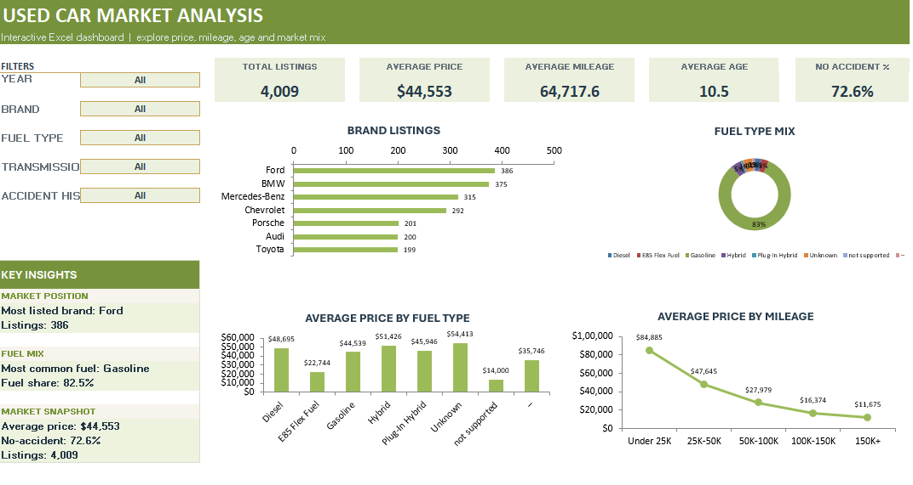
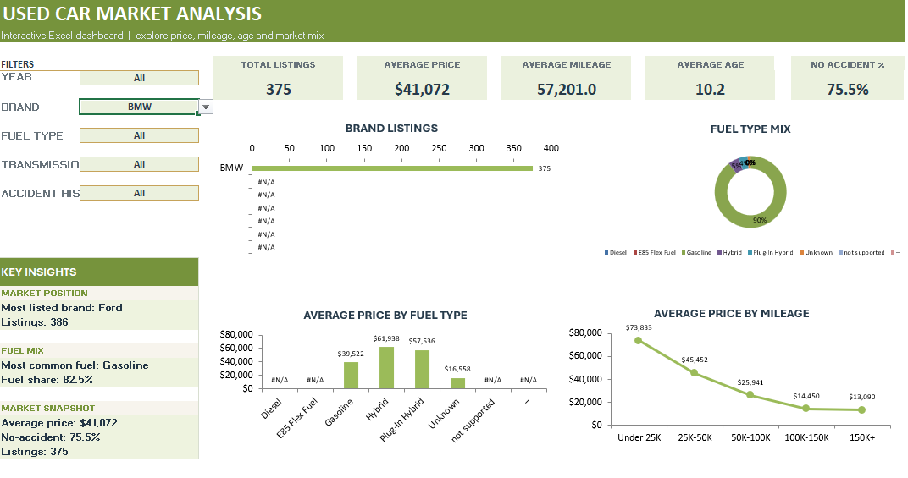
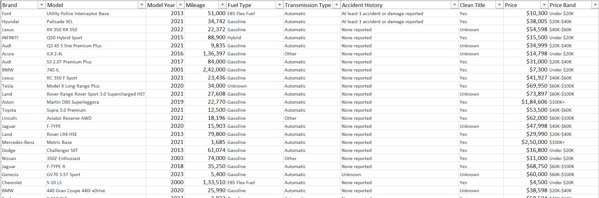

# Used Car Market Analysis Dashboard

Interactive Excel dashboard analysing **4,009 used car listings** by price, mileage, age, fuel type and brand.

## Key Insights
- **Ford** is the most listed brand (386 listings), followed by BMW (375) and Mercedes-Benz (315).
- **83%** of listings are gasoline cars; hybrids have a higher average price (~$51K vs ~$44.5K for gasoline).
- Average price falls sharply as mileage rises: from ~$85K for cars under 25K miles to ~$12K for 150K+ miles.
- About **25%** of listings have an accident or damage reported.
- Overall averages: price **$44,553**, mileage **64,718 miles**, age **10.5 years**.

## Features
- Dropdown filters for Year, Brand, Fuel Type, Transmission and Accident History
- 5 KPI cards: Total Listings, Average Price, Average Mileage, Average Age, No Accident %
- 4 charts: Brand Listings, Fuel Type Mix, Average Price by Fuel Type, Average Price by Mileage
- Insight cards for top brand, most common fuel type, accident % and price drop with mileage

## Screenshots

**Filtered view (Brand = BMW)**

**Raw data**

## Tools Used
Microsoft Excel: data cleaning, formulas, data validation dropdowns, charts, dashboard design

## Data Source
[Used Car Price Prediction Dataset](https://www.kaggle.com/datasets/taeefnajib/used-car-price-prediction-dataset), from Kaggle.

